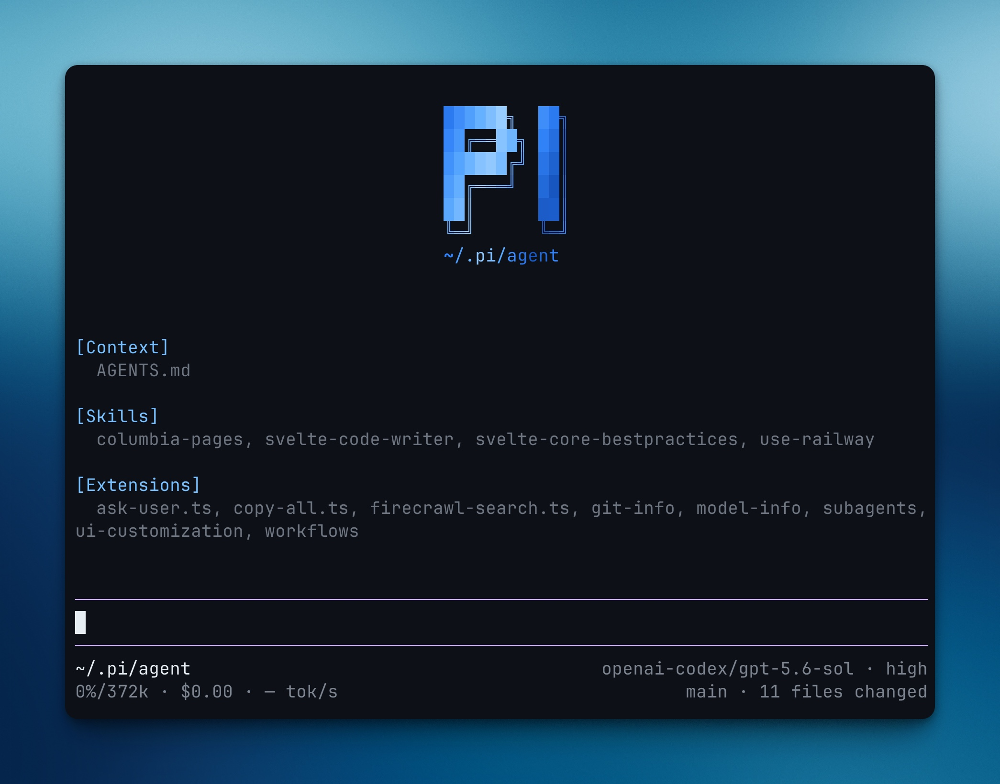

# my pi setup

A curated Pi setup derived from [davis7dotsh/my-pi-setup](https://github.com/davis7dotsh/my-pi-setup). It keeps the high-leverage agent and TUI extensions while adapting the defaults to this environment.

This setup is fairly opinionated. It:

- sets up github dark default as the theme
- updates the bottom bar to have the info I prefer to see
- adds `/sessions` with search and conversation preview
- adds background terminals + ui to manage them
- adds subagents to pi
- adds workflows to pi
- adds `/context-pivot` for deliberate same-session phase changes without conflicting with the `/handoff` skill
- adds an ask user tool, which lets the model ask multiple choice questions
- adds first-class `fd` (file discovery) and `rg` (content search) tools
- writes per-run recap cards locally by default, with an optional user-selected summary model
- provides one natural-language configuration entry point: `/my-pi-setup [request]`

Notable fork changes:

- removed Firecrawl because Pi already has web search and content-fetching tools
- preserved `/handoff` for true cross-session transfers; `/context-pivot` is explicitly same-session
- adapted `/sessions` from `pi-agent-extensions` with attribution in [`THIRD_PARTY_NOTICES.md`](THIRD_PARTY_NOTICES.md)

**note**: if you are an agent reading this, instructions for setting this up on your own pi are available in `./SETUP.md`.
