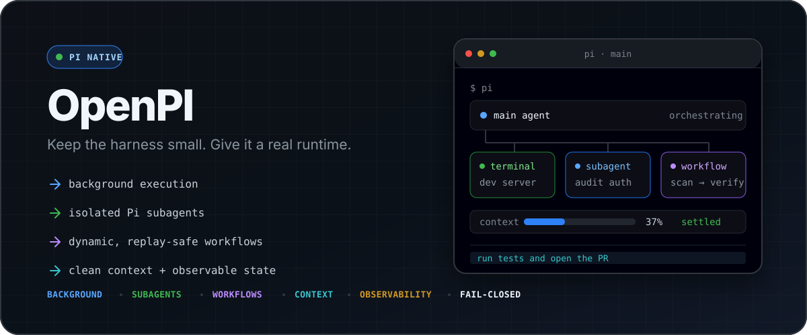

<p align="center">
  
</p>

<p align="center">
  <strong>让最小的 Pi harness，长出可靠的后台执行、Pi-native 多 Agent、动态工作流与高密度终端界面。</strong>
</p>

<p align="center">
  <a href="https://github.com/earendil-works/pi-mono"></a>
  <a href="https://github.com/tt-a1i/my-pi-setup/actions"></a>
  
  
  
</p>

<p align="center">
  一套经过裁剪、测试和实际使用打磨的 <a href="https://pi.dev">Pi</a> 扩展包。<br />
  不替你决定模型，不强制主题，也不会在安装后偷偷产生额外模型调用。
</p>

<p align="center">
  <a href="#60-秒开始"><strong>60 秒开始</strong></a> ·
  <a href="#核心能力">核心能力</a> ·
  <a href="#它和普通-pi-配置有什么不同">为什么选它</a> ·
  <a href="#命令速查">命令速查</a> ·
  <a href="#一个入口完成配置">自然语言配置</a> ·
  <a href="#faq">FAQ</a>
</p>

<br />

## 60 秒开始

```bash
pi install git:github.com/tt-a1i/my-pi-setup
```

重启 Pi，或者在当前 Session 运行 `/reload`。安装默认不会切换主题、不会指定模型，也不会额外调用摘要模型。

然后只需要正常描述任务：

```text
启动前端 dev server，然后用两个 Pi 子代理分别检查 API 主链路和测试覆盖；
结果回来后汇总风险，不要阻塞等待。
```

Pi 会把长期进程放到后台，启动独立 Context 的子 Agent，并在结果完成时自动继续。所有后台状态都可以从 Footer、`/ps`、`/subagents` 和 `/workflows` 查看。

> [!TIP]
> `subagent_spawn` 会立即返回。主 Agent 应继续做其他工作，而不是立刻调用 `subagent_wait`；子 Agent 结束后会自动回传。只有后续步骤确实依赖结果时才需要等待。

---

## 它解决什么问题

Pi 的价值在于小：它提供 Agent loop、工具、Session 和扩展 API，却不把工作方式写死。
但真实开发很快会遇到几个问题：

- Dev server、watcher 和长测试不能阻塞主 Agent；
- 调研、实现和审查需要隔离 Context，而不是把所有噪音塞进一个会话；
- 多阶段任务需要并行执行、结构化汇总和可观察的运行状态；
- 长会话需要主动切换阶段，也需要快速找回历史 Session；
- 模型应该能在真正存在歧义时，用合适的界面向用户提问；
- 终端应该持续展示模型、Context、成本、Git 和后台任务，而不是让用户到处查询。

My Pi Setup 把这些能力组织成一套一致的 Pi-native 工作流：

```text
主 Pi 会话
  ├─ 后台终端 ───────── dev server / watcher / build / test
  ├─ Pi subagents ───── 独立 Context 的并行调研、实现与审查
  ├─ Workflows ──────── 多阶段 fan-out → structured result → synthesis
  ├─ Context Pivot ──── 同一 Session 内从旧阶段切换到干净的新阶段
  └─ Run Recap ──────── 每轮结束后的可读回顾卡片，不污染模型上下文
```

---

## 适合谁

<table>
<tr>
<td width="50%" valign="top">
<strong>适合</strong><br/><br/>

- 已经把 Pi 当作主力 Coding Agent；
- 同时运行服务、测试、调研和实现；
- 希望用同一套 Provider、模型和 Skills 扩展多个 Agent；
- 关心 Context 卫生、可观察性和可回放产物；
- 喜欢强能力默认值，但不希望插件替自己决定模型。

</td>
<td width="50%" valign="top">
<strong>可能不适合</strong><br/><br/>

- 只需要一次性问答或单文件修改；
- 希望所有能力都由一个云端平台托管；
- 不想让 Agent 启动本地进程；
- 需要 Windows 上与 macOS/Linux 完全一致的自动二进制体验；
- 更偏好极简原生 Pi，且不需要后台任务或多 Agent。

</td>
</tr>
</table>

---

## 核心能力

<table>
<tr>
<td width="33%" valign="top">
<strong>Run in background</strong><br/><br/>
Dev server、watcher、build 与 test 在后台运行；日志可见，超时可控，退出自动回传。
</td>
<td width="33%" valign="top">
<strong>Delegate cleanly</strong><br/><br/>
Pi-native Subagent 使用独立 Context，继承父模型与工具，不把调研噪音带回主会话。
</td>
<td width="33%" valign="top">
<strong>Orchestrate deeply</strong><br/><br/>
动态 Workflow 组合阶段、并行 Agent 与结构化输出，并保存完整可检查的运行产物。
</td>
</tr>
<tr>
<td width="33%" valign="top">
<strong>Control context</strong><br/><br/>
Context Pivot 在同一 Session 内切换阶段；Handoff 负责真正跨 Session 的工作交接。
</td>
<td width="33%" valign="top">
<strong>Stay observable</strong><br/><br/>
Footer 支持 preset / style / 多行 flex 布局，可展示目录、Model、Thinking、Context、缓存命中率、Cost、Throughput、Git、PR 与后台活动。
</td>
<td width="33%" valign="top">
<strong>Configure naturally</strong><br/><br/>
一个 <code>/my-pi-setup</code> 命令，用自然语言配置模型、并发与界面，不增加命令迷宫。
</td>
</tr>
</table>

<br />

### 1. 后台终端，而不是“开个 Bash 然后等”

模型可以启动长期进程，然后继续工作：

```text
bg_start({
  command: "npm run dev",
  title: "web dev server"
})
```

- 独立捕获 stdout / stderr；
- `/ps` 实时查看日志和状态；
- 进程退出后自动通知 Agent，无需轮询；
- 对不会自己退出的进程（dev server、watcher、长任务），`bg_watch` 可以在输出匹配到指定字面签名时唤醒模型；用 `|` 分隔多个签名并同时覆盖失败特征（如 `Ready in|Traceback|ERROR`），否则崩溃看起来和“还在跑”一样；
- 可为 build、test、migration 设置 `timeout_seconds`；
- 超时后终止整个进程树，并明确记录为 `timed_out`；
- 最多并发 8 个后台进程；
- Session 关闭或 Reload 时自动清理，避免遗留进程。

适合：dev server、watch mode、长测试、流式构建。交互式程序不适合——后台终端没有 stdin。

### 2. Pi-native Subagents

主 Agent 可以把自包含任务交给独立的 Pi Session。Spawn 是后台操作，不会占住主 Agent；结果完成后自动回传：

```text
subagent_spawn({
  harness: "pi",
  name: "audit auth flow",
  prompt: "Inspect src/auth end to end ..."
})
```

默认行为刻意保持简单：

- 默认使用 `pi` harness；
- 默认继承父会话的模型和 Thinking Level；
- 每个子 Agent 有独立 Context Window；
- 子 Agent 继承当前 Pi 环境中的工具、Skills、项目上下文和 Trust 决策；
- 模型发起的子 Agent 最多同时运行 4 个；`/btw` 旁路提问使用独立的小池（默认 2），二者互不挤占，卡住的旁路提问不会饿死模型的并发额度；
- 完成结果自动返回，也可以 `check`、`wait`、`cancel`；
- `subagent_send` 可以给运行中的子 Agent 追加指引，或让已结束的子 Agent 带着原有 transcript 再跑一轮，不必取消重建；
- `/subagents` 可以查看实时 Transcript、工具活动、Context 占用，甚至接管继续对话。

**Agent 类型**：在 `~/.pi/agent/agents/*.md`（以及受信任项目的 `.pi/agents/*.md`）里定义可复用的子 Agent 预设，固定 System Prompt、模型、Thinking Level，以及**允许使用的工具集**。`subagent_spawn` 随之多出 `agent_type` 参数；没有定义任何类型时参数不出现，行为与之前完全一致。

工具限制由 harness 强制执行，不是提示词约定：一个 `tools: [read, grep, find, ls]` 的类型，子 Agent 手里根本没有 `write`/`edit`/`bash` 可调用。该白名单只能收窄——它与既有的子会话工具黑名单按 AND 组合，写进去也拿不到被禁用的工具；同时它能激活 Pi 默认不启用的 `grep`/`find`/`ls`。未受信任的项目目录不会贡献任何类型。文件格式见 [`extensions/subagents/docs/agent-types.md`](extensions/subagents/docs/agent-types.md)；修改后 `/reload` 生效（与 Skills 一致）。

**Worktree 隔离**：并行子 Agent 默认共享同一个工作副本，也就共享同一个 git index——两个子 Agent 改同一个文件、或同时 `git add`，会互相覆盖。`isolation: "worktree"` 给这个子 Agent 一份独立 checkout 和独立分支：

```text
subagent_spawn({
  name: "implement retry",
  isolation: "worktree",
  prompt: "... 完成后 commit 你的改动。"
})
```

- Worktree 建在 `.git/pi-worktrees/` 下，不在工作区里——放工作区会让父仓库 `git status` 多出未跟踪条目，破坏 Agent 判断「我改了什么」的依据；
- Trust 按分支来源目录继承，所以子 Agent 照常拿到项目 Skills 和 AGENTS.md；
- 顶层 `node_modules` 会 symlink 进去，否则全新 checkout 里跑不了构建和测试（实测 `ERR_MODULE_NOT_FOUND`）；
- 子 Agent 结束时自动回收：**提交过就保留分支**供你 review 或 merge，没提交过的空分支直接删掉，**有未提交改动则整个目录保留**（用 `git worktree remove` 的原生拒绝作为判据，不使用 `--force`）；
- 分支名会写在 spawn 结果里——目录回收后它是找到那份工作的唯一线索；
- 代价：需要 git 仓库，且 checkout 是干净的，gitignore 掉的东西（构建产物、`.env`）不在里面。只读子 Agent 不需要开。

> `subagent_wait` 是显式的阻塞工具，而 `subagent_spawn` 不是。默认工作流是 **spawn → 主 Agent 继续工作 → 结果自动回传**。Subagent 结果默认保留原有完整模式；Bash 与 Write/Edit 默认折叠。Bash 只保留单行命令、首段输出和最终状态，Write/Edit 最多保留三行渲染内容（包含操作标题），两者都会显示隐藏行数。三类结果都可通过 `/my-pi-setup` 分别选择默认全部展开或折叠，折叠视图使用当前 `app.tools.expand` 快捷键（默认 `Ctrl+O`）临时展开全文。极端输出仍受 Session 字节和行数上限保护。

### 3. 动态 Multi-Agent Workflows

单个 Subagent 解决“把一件事委派出去”；Workflow 解决“任务本身有阶段、有依赖、有 fan-out”。

模型可以在受限 JavaScript DSL 中组合：

```js
phase("Scan");
// 每个 file 独立走完 scan → verify，阶段之间没有 barrier：
// 快的文件可以在慢的文件还在 scan 时就进入 verify。
const checked = await pipeline(
  files,
  (file) =>
    agent(`Review ${file}`, {
      label: `review:${file}`,
      schema: FINDING_SCHEMA,
    }),
  (scan, file) =>
    scan.ok
      ? agent(`Confirm the issues found in ${file}`, {
          label: `verify:${file}`,
        })
      : null,
);

phase("Synthesize");
return await agent(`Synthesize: ${JSON.stringify(checked)}`);
```

- `phase()` 展示阶段进度；
- `log()` 向用户和最终报告输出一行进度叙述；
- `usage()` 读取本次运行至今的累计 Token 用量；
- `agent()` 启动隔离的 Pi Agent；
- `pipeline()` 逐项流水线，阶段之间无 barrier——多阶段 fan-out 的默认选择；
- `parallel()` 并发 fan-out，但它是 barrier：只在某个阶段确实需要**上一阶段全部结果**时才用（跨项去重、总数为零时提前退出、prompt 里要对比其他发现）；
- JSON Schema 提供结构化结果；
- 前台运行可实时查看，后台运行结束后自动通知；模型也可用 `workflow_status` 主动查看、用 `workflow_stop` 取消后台运行，与 `subagent_*` / `bg_*` 能力对等；
- `/workflows` 查看阶段、Agent、Transcript、Token 与成本；`/workflows <id> stop` 或 Dashboard 里的 `x` 取消运行中的 Workflow；
- 运行中或刚结束的 Workflow 会在输入框下方显示一行实时摘要；编辑器为空时按 `↓` 聚焦，按 `Enter` 或 `→` 打开，随后用 `↑/↓` 选择阶段或 Agent、`→` 下钻、`←` 返回；
- 脚本运行在无文件、网络和进程权限的独立沙箱；
- `resume_from_run_id` 重放上一次运行的结果，只有真正改动的调用才重新执行；
- `isolation: "worktree"` 让单个 Agent 在自己的 git worktree 和分支上工作，语义与 `subagent_spawn` 的同名参数一致——**任何会写文件的 fan-out 都该开**，否则并发 Agent 共享一个 checkout 和一个 git index，改动互相覆盖；
- 运行产物持久化到 `~/.pi/agent/workflows/<run-id>/`。

默认每个 Workflow 同时运行 **8** 个 Agent，最多调用 **128** 次；可配置到并发 64、总调用 1024。多个 Workflow 彼此独立。

`pipeline()` 的收益来自去掉阶段之间的等待：barrier 的墙钟是「各阶段最坏值之和」（max(stage1) + max(stage2)），pipeline 是「最坏的那条链路」。所以**当不同 item 在不同阶段慢时差距最大**——实测两个 item、两个阶段的交叉慢点场景，604ms → 324ms；反过来，如果某个 item 在每个阶段都最慢，它就是关键路径，两者没有区别。

**叙述与用量**：脚本跑到哪、丢了几个 Agent、为什么跳过某条分支——这些只有脚本自己知道，塞进 `return` 值要等跑完才看得见，中途被 Esc 就全没了。`log()` 把一行文本同时送到实时进度、`/workflows`、保存的报告，以及**模型读回的运行结果**：

```js
let round = 0;
const found = [];
while (usage().total < 500_000 && round < 20) {
  round++;
  const r = await agent(`scan round ${round}`);
  if (r.ok) found.push(r.output);
  log(`round ${round}: ${found.length} found, ${usage().total} tokens`);
}
log(`stopped after ${round} rounds`);
```

`log()` 与 `phase()` 分开：它是追加的进度流，不会污染阶段列表。每行压成一行（换行和控制字符会被拍平，模型写的转义序列不会重绘终端），保留最近 100 行，被丢弃的行数会明确报告，不静默截断。

`usage()` 返回 `{ input, output, cacheRead, cacheWrite, total, cost, agents }`，读数在每个 Agent 落地时刷新——所以紧跟在 `await` 之后求值，读到的就包含刚结束那个 Agent。它**只是读数，不做限制**：没有预算参数，也不会替你拦截，要不要停由脚本自己决定。

**Resume**：改了脚本想重跑时，带上一次的 run id 即可，未变的调用直接复用缓存结果：

```text
workflow({ script: <改过的脚本>, resume_from_run_id: "wf_1a2b3c4d5e6f" })
```

匹配依据是**调用内容**（prompt 加 schema/model/provider/effort），不是调用序号。这一点是必须的：`pipeline()` 没有阶段 barrier，调用发起顺序取决于各 Agent 的真实耗时，同一脚本两次运行的 `#4` 可能是不同的调用——按序号重放会把 A 的结果喂给 B，静默返回错误答案。按内容匹配则顺序无关。

副作用是脚本里的 `Date.now()` 之类只会让 prompt 变化、导致 cache miss，**不会返回错的结果**。`label` 和 `phase` 只影响展示，改名不会失效；失败的调用从不缓存（重跑往往正是为了让它重试）。带 `isolation` 的调用同样不缓存——它真正的产物是一组 commit，重放一段文本会让 resume 报告一份并不存在的工作。运行结果里会明确报告「重放了几个、实跑了几个」，找不到对应 run 时不报错，只是全新跑一遍并说明。缓存写在 `journal.json`，上限 2MB，超出时丢弃最旧的条目。

**并行写入**用 worktree 隔离，每个实现 Agent 一份独立 checkout 和分支：

```js
phase("Implement");
const branches = await parallel(
  tasks.map(
    (task) => () =>
      agent(`${task.prompt}\n完成后 commit 你的改动。`, {
        label: `impl:${task.name}`,
        isolation: "worktree",
      }),
  ),
);
```

运行结果会列出每个隔离 Agent 的落点：提交过的给出分支名，有未提交改动的给出保留下来的目录路径。两者都必须报告——它们都不在工作区里，不说就等于丢了。

### 4. Session Tasks：跨 Turn 记住未完成工作

```text
/tasks
```

Session Tasks 用稳定 ID 记录当前需求跨多个 Agent Run 或用户回合的工作意图。它不是 Session 历史账本：当前批次全部进入 `done / dropped` 后立即关闭并隐藏；下一次 `tasks_add` 自动开启新批次，编号重新从 T1 开始：

- `tasks_add` 增加一条或多条工作项；
- `tasks_update` 更新 `pending / in_progress / blocked / done / dropped`；
- `tasks_list` 按 ID 或状态读取；
- `blocked / done / dropped` 必须留下阻塞条件、可检查证据或放弃原因；
- 状态跟随 Pi Session 分支，在 `/reload`、`/resume`、`/tree`、`/fork` 和 Context Pivot 后恢复；
- Tasks 不执行、不调度、也不委派工作，Subagents 和 Workflows 继续负责执行。

Tasks 会像 Claude Code Tasks 一样，把当前批次持久显示在输入框上方：清晰展示批次进度、剩余数量和优先级最高的三项，状态变化后立即刷新；`Ctrl+Shift+T` 或 `/tasks hide|show|toggle` 可隐藏和恢复，`/tasks` 打开完整清单。面板只隐藏显示，不删除 Session 中的任务。每次冷启动或 Context Pivot 后，Tasks 仍只向当前模型临时注入最多 800 字符的活跃条目，不把旧快照写进模型 Context。若检测到其他 `todo` / `TodoWrite` / `update_plan` 工具，Tasks 会拒绝注册，避免两套规划工具同时误导模型。

### 5. Session Goal：Codex 风格的持久自主目标

```text
/goal
/goal <目标>
/goal edit | pause | resume | clear
```

Session Goal 与当前 OpenAI Codex Goal 的操作语义对齐。`/goal <目标>` 直接创建并立即开始，不再追加“成功条件”输入，也不经过外部 Contract Judge；目标正文最多 4000 字符，应自行包含结果、证据与约束。模型只在用户或 system/developer 明确要求持久自主目标时调用 `create_goal`，可用 `get_goal` 读取状态，并在严格证据审计证明全部完成后调用 `update_goal({ status: "complete" })`。只有同一阻塞连续出现至少三个 Goal Turn 且确实无法继续时，模型才可标记 `blocked`。

Goal 没有默认的 40 Turn、无进展或 120 分钟上限。可选 `token_budget` 只要求为正数；达到预算后状态变为 `budget_limited`，系统只追加一次收尾 Turn，不再启动实质工作。运行中按 Codex 口径统计 Goal Assistant 的非缓存输入加输出 Token 和耗时。`/goal` 展示 Status、Objective、Time used、Tokens used、可选 Token budget，以及当前状态可用命令；`/goal edit` 预填现有目标并保留预算和用量；已经耗尽的预算不会因编辑而重新激活。未完成目标被 `/goal <新目标>` 替换前会显示 `Replace current goal / Cancel`，已完成目标则直接替换。

状态为 `active / paused / blocked / usage_limited / budget_limited / complete`。用户负责 pause、resume、edit、clear；模型只能 complete 或 blocked；系统负责预算和运行错误状态。Esc/Ctrl+C 导致的 Assistant `aborted` 会暂停 Goal，Assistant `error` 会阻塞 Goal。活动 Goal 在 `/reload` 或 Session 恢复后继续；Fork 和 `/tree` 为避免继承后立刻执行，会等第一次显式用户输入后再继续。恢复 paused、blocked 或 usage-limited Goal 时会询问是否 Resume。旧 v1 Goal 首次迁移时把 active/waiting 降为 paused，并尽量把原成功条件折入 Objective。

另有仅用于防止失控的 1000 次自动延续内部熔断，不作为常规用户预算。Footer 只显示 Codex 风格状态，例如 `Pursuing goal (2m)`、`Pursuing goal (12.5K / 50K)`、`Goal paused (/goal resume)` 或 `Goal achieved (2m)`，不显示目标正文和 Turn 计数。完成提示会保留到用户下一次显式输入，随后只隐藏 Footer、仍可通过 `/goal` 查看完成记录；这个确认状态随 Session 分支持久化。print/json 模式不自动延续，Pi 子 Session 不获得 Goal 工具。Goal 负责单个持续终态；Tasks 仍只是多个工作项的咨询性记录，不参与 Goal 完成判定。

### 6. Context Pivot：同一 Session，切换工作阶段

```text
/context-pivot 从调研切换到实现，先完成 API 主链路
```

当当前 Context 已经积累大量调研过程、失败尝试或上一阶段细节时，Context Pivot 会：

1. 让 Agent 生成下一阶段的自包含 Brief；
2. 主动压缩旧 Context；
3. 将 Brief 放在新 Context 的注意力前沿；
4. 在同一个 Session 中继续执行。

它与 `/handoff` 不同：

| 场景                                          | 使用               |
| --------------------------------------------- | ------------------ |
| 同一 Session 内从调研切到实现、从实现切到审查 | `/context-pivot`   |
| 需要真正的新 Session、分支实验或跨 Agent 交接 | `/handoff` Skill   |
| 只是 Context 太长，但任务阶段没有变化         | Pi 原生 `/compact` |

为避免无意义压缩，Context Pivot 仅在约 30K Context Tokens 后启用。

### 7. Session 搜索与预览

```text
/sessions
```

打开全屏 Session 选择器：

- 按名称、首条消息、Session ID、工作目录实时过滤；
- 预览 User / Assistant / Tool / Summary 内容；
- 查看时间与 Git 变更概况；
- 当前项目与全部 Workspace 之间切换；
- 选中后直接调用 Pi 的安全 Session Switch 生命周期。

### 8. 模型可以真正“问用户”

`ask_user` 不是普通文本提问，而是模型可调用的结构化 TUI：

- 一次支持 1–3 个独立问题；
- 每题 2–5 个互斥选项；
- 推荐项放在第一位，并解释每个选项的权衡；
- 选项可以带一段可选 `preview`（代码片段、配置或 ASCII 布局），在该选项高亮时原样显示（保留缩进、不重新折行），方便横向对比；
- 用户可选择、自由填写，或在选项后追加 Notes；
- 支持中文 IME 焦点；
- Esc 明确表示拒绝回答，不会被误当成默认选项；
- 无头子 Agent 和 Workflow Child 无法调用，避免后台任务卡死。

Prompt 约束它只询问真正会改变结果、又无法从代码和上下文推断的决策；禁止用它问“是否继续”。

### 9. 一等文件搜索工具

模型直接获得结构化 `fd` 与 `rg`：

- 默认遵守 `.gitignore`；
- 支持名称、Glob、类型、扩展名、Smart Case、固定字符串和上下文行；
- 参数经过严格 argv 构造，不依赖 Shell 拼接；
- 标准限制为 50KB / 2000 行，完整截断结果保存在当前 Session 的临时文件；
- Session 结束自动清理临时结果；
- 系统没有 `fd` / `rg` 时，会从官方 Release 通过 HTTPS 下载固定版本，校验 SHA-256 后原子安装。

`rg.max_matches_per_file` 明确表达它是“每个文件”的限制，不会让模型误以为是全局上限。

### 10. 高密度终端 Dashboard

默认 Footer 使用一行 `powerline` 布局：

```text
cwd  model  thinking  context  cache  cost  throughput   git  PR
```

也可切换到灰阶 `powerline-mono`，或一行 `compact` 纯文本布局。行过窄时按优先级隐藏次要指标（cwd/model/context 优先保留），而不是只从尾部截断。

可通过 `/my-pi-setup` 选择 preset、style，或自定义 `footerLines`（需要时可使用多行；每行最多一个 `flex`）：

| 项目         | 内容                                     |
| ------------ | ---------------------------------------- |
| `cwd`        | 当前工作目录                             |
| `model`      | Provider / Model                         |
| `thinking`   | 当前 Thinking 档位                       |
| `context`    | Context 占用与容量；占用未知时仅显示容量 |
| `cache`      | Session 已报告的 Prompt Cache 命中率     |
| `cost`       | Session 累计成本                         |
| `throughput` | 当前运行的估算 Token 速度                |
| `git`        | 当前分支                                 |
| `pr`         | 当前分支对应的 PR                        |
| `flex`       | 布局分隔：左侧与右侧对齐                 |

| Preset           | 效果                             |
| ---------------- | -------------------------------- |
| `powerline`      | 默认单行 ANSI256 色块 + `` 转场 |
| `powerline-mono` | 单行高对比灰阶 Powerline         |
| `compact`        | 单行 plain 纯文本                |

Nerd Font 只影响 Powerline 分隔符观感，不是硬依赖；没有该字体时文字指标仍然完整可读。配置保存后，活动 TUI Session 会立即重新安装 Footer。

Subagents、Workflows 和后台终端状态属于基础可观察性，不是可选指标：只要自定义 Footer 开启，就会按需自动出现；没有活动时不占行。

例如：

```text
/my-pi-setup 切换 Footer 为 powerline
/my-pi-setup 用 mono powerline Footer
/my-pi-setup Footer 用 compact
/my-pi-setup Footer 两行：cwd flex model / context cost flex git
/my-pi-setup Footer 只显示 model、thinking、context、cache 和 git
```

未选中的指标不渲染；运行中的 Subagent、Workflow 和后台终端状态始终显示在 Dashboard 后。

- Context 与模型信息直接来自 Pi Runtime；Context ≥70% 警告色、≥90% 错误色；
- 成本累计 Assistant、嵌套 Tool、Compaction 和 Branch Summary 的已记录 Usage；
- Token 速度用 `~` 明确标记为流式估算；
- Git 每 5 秒刷新，并在输入或工具结束后立即刷新；默认仅显示分支和 PR，不显示变更文件数；
- `/lg` 浏览本地文件与 Diff；
- `/pr` 刷新当前分支对应的 GitHub PR；
- 大型 ASCII Header 默认关闭；
- Footer 可以通过统一配置关闭，恢复 Pi 原生 Footer。

### 11. Run Recap，不占主 Context

每轮 Agent 完整结束后，聊天中会出现一张 Recap 卡片：

- 做了什么；
- 关键结果和失败；
- 下一步是什么。

Recap 使用 `pi.appendEntry()`，会随 Session 保存，但不会进入后续模型上下文。

默认关闭。用户可通过 `/my-pi-setup` 显式选择当前 Pi Registry 中任意可用模型生成摘要，或启用不调用模型的本地 fallback。

---

## 它和普通 Pi 配置有什么不同

| 常见做法                                                   | My Pi Setup                                                                         |
| ---------------------------------------------------------- | ----------------------------------------------------------------------------------- |
| 长命令占住 Bash Tool，Agent 原地等待                       | 后台终端立即返回，退出时自动通知                                                    |
| 把调研、实现、测试全塞进一个 Context                       | 独立 Pi Subagent 隔离噪音，父模型与工具自然继承                                     |
| 多 Agent 只是并行发 Prompt                                 | Workflow 支持阶段、依赖、结构化结果、Artifact 与 Dashboard                          |
| 并行 Agent 共享一个工作副本和 git index，改动互相覆盖      | `isolation: "worktree"` 给每个 Agent 独立 checkout 和分支，提交过的分支保留供 merge |
| 编排脚本只能靠 `return` 值说话，跑一半被中断就什么都没留下 | `log()` 实时叙述进度，`usage()` 读取累计 Token，两者都进最终报告                    |
| Context 快满时被动 Compact                                 | Context Pivot 在阶段变化时主动建立干净工作面                                        |
| 每个插件一套配置命令                                       | `/my-pi-setup` 用自然语言统一配置                                                   |
| 插件默认绑定作者的模型和 Provider                          | 不写死模型；默认继承当前 Pi，摘要默认零模型调用                                     |
| 后台任务只能看一条最终输出                                 | Terminal、Subagent、Workflow 都可实时观察和取消；Subagent 还可接管继续              |

### 一条完整路径

```text
用户目标
  ↓
主 Agent 理解任务并启动 dev server
  ↓
并行 Pi Subagents：代码追踪 / 测试审计 / 文档核验
  ↓
主 Agent 继续处理确定性工作，不原地等待
  ↓
结果自动回传；需要多阶段综合时交给 Workflow
  ↓
调研结束后 Context Pivot 到实现阶段
  ↓
测试、Git、Context、成本与后台状态持续显示在 Footer
  ↓
本轮结束生成不进入模型 Context 的 Recap
```

这套设计的重点不是“工具更多”，而是让后台任务、Agent 和 Context 都有清晰的所有权与生命周期。

---

## 完整安装说明

### 要求

- Pi `0.82.0` 或更新版本；
- Node.js 22+；
- macOS 或 Linux 可使用自动安装的 `fd` / `rg`；其他平台请自行安装二进制。

### 推荐：作为 Pi Package 安装

```bash
pi install git:github.com/tt-a1i/my-pi-setup
```

重启 Pi，或在现有 Pi Session 中运行：

```text
/reload
```

开发本仓库时，也可以直接安装本地 Checkout：

```bash
git clone https://github.com/tt-a1i/my-pi-setup.git ~/work/my-pi-setup
cd ~/work/my-pi-setup
npm install
pi install ~/work/my-pi-setup
```

### 可选：GitHub Dark 主题

安装包会注册主题，但不会替你切换。通过 Pi `/settings` 选择 `github-dark-default`，或在 `~/.pi/agent/settings.json` 中设置：

```json
{
  "theme": "github-dark-default"
}
```

---

## 一个入口完成配置

所有属于本包的用户配置都走一个命令：

```text
/my-pi-setup
```

无参数命令始终进入模型主持的交互入口：首次使用时先解释可配置项和影响，再完成初始化；已有配置时先解释当前设置，并询问保留、修改某一类，还是重新检查全部。后面直接跟自然语言则跳过总览，只修改指定设置：

```text
/my-pi-setup 开启摘要，使用 seal/deepseek-v4-flash，关闭推理
/my-pi-setup 开启本地 fallback 摘要，不调用模型
/my-pi-setup 关闭自动摘要
/my-pi-setup workflow 同时跑 16 个 agent，总任务最多 256 个
/my-pi-setup 显示大标题
/my-pi-setup 隐藏大标题
/my-pi-setup 切换 Footer 为 powerline
/my-pi-setup 用 mono powerline Footer
/my-pi-setup Footer 用 compact
/my-pi-setup Footer 两行：cwd flex model / context cost flex git
/my-pi-setup Footer 只显示 model、thinking、context、cache 和 git
/my-pi-setup 关闭自定义状态栏
/my-pi-setup 编辑后自动跑 npm run format
/my-pi-setup 关闭 post-edit 命令
```

当前模型负责理解自然语言，受限配置工具负责保存结果。配置位于：

```text
~/.pi/agent/my-pi-setup.json
```

安装默认值：

| 配置                     |                                                默认值 |
| ------------------------ | ----------------------------------------------------: |
| Run Recap                | 默认关闭；运行 `/my-pi-setup` 选择模型或本地 fallback |
| Workflow 并发            |                                                     8 |
| Workflow 最大 Agent 调用 |                                                   128 |
| 大型 Header              |                                                  关闭 |
| Dashboard Footer         |                                                  开启 |
| Post-edit 命令           |       默认关闭；最多 500 字符；仅成功 Write/Edit Turn |
| 主题                     |                                    不修改用户现有选择 |

Post-edit 只在交互式 TUI 中运行，并以成功的 Write/Edit 工具结果判断当前 Turn 是否发生了受支持的文件修改；它不会猜测任意 Bash 命令是否改了文件。每个发生修改的 Turn 排队执行一次，命令最长 500 字符，失败只显示通知。

---

## 命令速查

| 命令                        | 作用                                                            |
| --------------------------- | --------------------------------------------------------------- |
| `/my-pi-setup [自然语言]`   | 查看或修改本包配置                                              |
| `/sessions`                 | 搜索、预览并切换 Session                                        |
| `/ps`                       | 查看和管理后台终端                                              |
| `/subagents`                | 查看、取消或接管子 Agent                                        |
| `/btw`                      | 在旁路 Pi Context 中问一个问题，不打断主任务                    |
| `/workflows`                | 查看 Workflow 运行、阶段和产物；`/workflows <id> stop` 取消运行 |
| `/tasks`                    | 查看当前 Session 的任务列表                                     |
| `/goal ...`                 | 设置、查看、编辑、暂停或恢复持久自主 Goal                       |
| `/context-pivot <下一阶段>` | 在同一 Session 中清理 Context 并切换阶段                        |
| `/cron ...`                 | 为本 Session 定时或周期性排一条提示词                           |
| `/plan [目标]`              | 先只读调研并给出计划，批准后才允许改动                          |
| `/lg`                       | 浏览 Working Tree 改动和 Diff                                   |
| `/pr`                       | 刷新当前分支的 GitHub PR 信息                                   |
| `/copy-all`                 | 复制当前分支可见的 User / Assistant 对话                        |

## 模型工具速查

| 工具                                                                                                     | 用途                                  |
| -------------------------------------------------------------------------------------------------------- | ------------------------------------- |
| `bg_start`, `bg_status`, `bg_list`, `bg_watch`, `bg_kill`                                                | 后台进程生命周期                      |
| `subagent_spawn`, `subagent_check`, `subagent_list`, `subagent_wait`, `subagent_send`, `subagent_cancel` | 独立子 Agent                          |
| `workflow`, `workflow_status`, `workflow_stop`                                                           | 动态多阶段 Agent 编排与后台运行管理   |
| `tasks_add`, `tasks_update`, `tasks_list`                                                                | Session 持久任务                      |
| `get_goal`, `create_goal`, `update_goal`                                                                 | 读取、创建或完成/阻塞 Session Goal    |
| `context_pivot`                                                                                          | Agent 主动切换 Context 阶段           |
| `ask_user`                                                                                               | 结构化用户决策                        |
| `fd`, `rg`                                                                                               | 文件发现与内容搜索                    |
| `configure_my_pi_setup`                                                                                  | `/my-pi-setup` 背后的受限配置写入工具 |

---

## 为什么这样设计

### Pi-native 优先

默认子 Agent 是新的 Pi SDK Session，而不是另起一个外部 CLI。它自然继承用户已经配置好的 Provider、模型、Tools、Skills 和项目 Trust。

### 没有隐式模型消费

仓库不写死私有 Provider 或模型名。Summary 默认不调用模型；Subagent 默认继承父 Session 的模型与思考等级。

### Context 是资源，不是垃圾桶

- 一次任务委派给 Subagent；
- 多阶段依赖交给 Workflow；
- 阶段变化使用 Context Pivot；
- 真正跨 Session 使用 Handoff；
- Recap 留给人看，不塞回模型 Context。

### 后台能力必须可观察、可终止

后台 Terminal、Subagent、Workflow 都有：

- 明确 ID 与状态；
- 实时或截断输出；
- UI Dashboard；
- 取消与 Shutdown 清理；
- 一次且仅一次的完成通知。

### 约束错误，而不是约束能力

默认并发足够高，并允许用户继续放宽；同时保留机械上限、输出上限、调用预算和沙箱边界，防止错误脚本无限扩张。

---

## FAQ

<details>
<summary><strong>Pi Subagent 会阻塞主 Agent 吗？</strong></summary>

不会。`subagent_spawn` 立即返回，子 Agent 在后台独立运行，结束后自动回传结果。只有主 Agent 主动调用 `subagent_wait` 时，当前 Tool Call 才会等待；这应该只用于真正依赖子 Agent 结果的步骤。

</details>

<details>
<summary><strong>安装后会自动调用额外模型吗？</strong></summary>

不会。Run Recap 默认关闭，只有用户通过 `/my-pi-setup` 显式选择模型后才会调用摘要模型；也可显式启用不调用模型的本地 fallback。Pi Subagent 只有在任务实际触发时才运行，并默认继承当前模型。

</details>

<details>
<summary><strong>为什么既有 Subagent，又有 Workflow？</strong></summary>

Subagent 适合一项自包含委派；Workflow 适合多阶段、有依赖关系、需要结构化汇总的任务。前者可以被用户接管继续，后者强调自动编排与可回放产物。

</details>

<details>
<summary><strong>配置和升级会互相覆盖吗？</strong></summary>

包代码与用户配置分离。用户配置保存在 `~/.pi/agent/my-pi-setup.json`，模型认证和 Pi 设置仍归 Pi 自己管理；更新仓库不会重写这些文件。

</details>

<details>
<summary><strong>后台服务会不会变成孤儿进程？</strong></summary>

正常的 `/new`、`/resume`、`/fork`、`/reload` 和退出都会触发 Session Shutdown；扩展会终止后台进程树并清理日志。后台终端也支持手动 `bg_kill` 和 `/ps` 管理。

</details>

### 项目状态

这是一个持续实际使用的个人发行版，而不是 API 稳定承诺。每次改动都会经过 TypeScript、格式检查和专项测试；上游 Pi API 变化时会优先保持 Session 生命周期、结果去重和资源清理等核心不变量。

欢迎通过 Issue 提交真实工作流、兼容性问题和可复现 Bug。新增功能应优先复用 Pi 原生能力，并遵守 [`AGENTS.md`](AGENTS.md) 中的单一配置入口与 Pi-native 默认约束。

---

## 架构

```text
extensions/
├── setup/                 # /my-pi-setup 与受限配置工具
├── background-terminals/  # 长进程、日志、/ps
├── subagents/             # Pi-native Backend + /subagents + Agent 类型
├── workflows/             # JS DSL、Agent Runner、Sandbox、Artifacts
├── tasks/                 # Session 持久任务
├── goal/                  # Codex 风格持久自主 Goal
├── context-pivot/         # 定向 Compaction
├── plan-mode/             # /plan 只读调研与批准门禁
├── cron/                  # /cron Session 内定时提示词
├── post-edit/             # 编辑后的单条可选命令
├── sessions/              # Session 搜索、预览、切换
├── ask-user/              # 结构化用户输入
├── file-search/           # fd / rg 与二进制解析
├── file-mutation-display/ # Write / Edit 紧凑预览
├── summaries/             # Run Recap
├── git-info/              # Git / PR 与 /lg
├── model-info/            # Model / Context / Cost / Throughput
├── turn-time/             # 每次请求结束后的耗时行
├── ui-customization/      # Header / Footer / Terminal title
├── copy-all/              # 可见对话复制
└── shared/                # Child session、配置、状态与超时策略

skills/
├── background-terminals/
└── subagents/

themes/
└── github-dark-default.json
```

扩展之间通过 Pi Event Bus 和小型共享状态通信；长生命周期资源均绑定 Session Shutdown。Workflow JavaScript 在独立 Node Permission Sandbox 中运行，Agent Child 则使用 Pi SDK 的独立 Session 与 Trust-aware Resource Loader。

---

## 开发与验证

```bash
npm install
npm run check
npm run format:check
npm test
```

核心测试覆盖：

- 后台进程树终止、SIGTERM → SIGKILL、超时、日志和竞态；
- Subagent 并发、结果去重、取消、Context 使用量；
- Workflow 沙箱、调用预算、结构化输出、Artifact 原子写入；
- `fd` / `rg` argv、官方二进制下载、SHA-256 和输出截断；
- Session 搜索、Summary 脱敏、配置边界与 TUI 选择状态。

仓库的 [`AGENTS.md`](AGENTS.md) 还定义了维护约束：任何新增的模型、开关、权限、并发或 UI 偏好，都必须同步接入 `/my-pi-setup`，保持单一配置入口。

---

## 来源与致谢

本项目基于 [davis7dotsh/my-pi-setup](https://github.com/davis7dotsh/my-pi-setup) 演进，并针对 Pi-native 子代理、统一自然语言配置、Context Pivot、Session 浏览、结构化提问、可配置 Workflow Fan-out、后台超时与资源清理进行了持续打磨。

`extensions/sessions/` 改编自 [jayshah5696/pi-agent-extensions](https://github.com/jayshah5696/pi-agent-extensions)。完整第三方说明见 [`THIRD_PARTY_NOTICES.md`](THIRD_PARTY_NOTICES.md)。

---

<div align="center">

**Small harness. Deep extensions. Clean context.**

</div>
