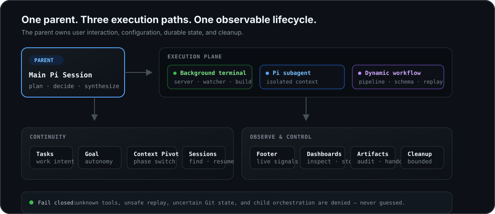

<p align="center">
  
</p>

<h1 align="center">OpenPI</h1>

<p align="center">
  <strong>Small harness. Deep extensions. Clean context.</strong>
</p>

<p align="center">
  给 <a href="https://pi.dev">Pi</a> 加一层可靠运行时：后台执行、隔离 Subagent、可恢复 Workflow、持续任务与可观测终端。<br />
  不替换 Pi，不替你选模型，也不把另一套 Agent 平台塞进来。
</p>

<p align="center">
  <a href="https://www.npmjs.com/package/@tt-a1i/openpi"></a>
  <a href="https://github.com/tt-a1i/openpi/actions/workflows/ci.yml"></a>
  <a href="https://github.com/earendil-works/pi-mono"></a>
  
  
</p>

<p align="center">
  <a href="#30-秒开始"><strong>30 秒开始</strong></a> ·
  <a href="#openpi-解决什么">解决什么</a> ·
  <a href="#能力地图">能力地图</a> ·
  <a href="#运行模型">运行模型</a> ·
  <a href="#三条执行路径">执行路径</a> ·
  <a href="#workflow-不只是并行">Workflow</a> ·
  <a href="#安全边界">安全边界</a> ·
  <a href="#配置与参考">配置与参考</a>
</p>

<p align="center">
  <sub>OpenPI 是独立社区项目，与 Physical Intelligence 的 openpi 机器人项目及 Pi 官方均无关联。</sub>
</p>

---

## 30 秒开始

```bash
pi install npm:@tt-a1i/openpi
```

重启 Pi，或在当前 Session 运行 `/reload`。然后直接描述真实任务：

```text
启动前端 dev server；并行检查 API 主链路和测试覆盖；
结果回来后汇总风险，主会话不要原地等待。
```

OpenPI 会把长期进程放到后台，把独立任务交给隔离 Context 的 Pi Subagent，把多阶段依赖组织成 Workflow。状态会持续显示；完整运行可从 `/ps`、`/subagents` 和 `/workflows` 检查或终止。

> [!IMPORTANT]
> 默认安装是安静的：不改主题、不绑定 Provider 或模型、不开启下一步预测，也不执行 post-edit 命令。OpenPI 自有偏好统一通过 `/openpi-setup` 显式配置。

```text
/openpi-setup
```

---

## OpenPI 解决什么

Pi 的价值在于小：Agent loop、工具、Session 与扩展 API 已经足够。真实项目缺的不是另一套平台，而是围绕这些原语的一层可靠运行时。

| 开发现场                                | OpenPI 的处理方式                                                            | 保留的边界                         |
| --------------------------------------- | ---------------------------------------------------------------------------- | ---------------------------------- |
| Dev server、watcher、长测试占住主 Agent | 后台 Terminal 管理进程树、日志、超时与完成通知                               | 无 stdin；Session 结束时有界清理   |
| 调研、实现、审查互相污染 Context        | 每个 Subagent 使用独立的进程内 Pi SDK Session                                | Child 不能递归编排或拿回父级工具   |
| 多阶段 fan-out 靠 Prompt 约定           | Workflow 提供 pipeline、schema、handoff、验收与持久产物                      | Sandbox 不暴露文件、网络或进程 API |
| 重跑昂贵，却不能信任旧结果              | 只 Replay 在可观测边界内证明为只读且指纹未变的调用                           | 不确定就真实执行，不猜             |
| 长任务跨回合后失去方向                  | Tasks、Goal、Plan Mode 与 Context Pivot 分别管理工作项、目标、批准和阶段切换 | 它们记录与控制，不伪造执行事实     |
| 后台能力看不见、停不住                  | Footer、Dashboard、Artifacts 与完成通知统一展示状态                          | 每类运行都有检查、取消与唯一终态   |

**核心原则：增强 Pi 的深度，不扩大隐式权限。** OpenPI 沿用用户已有的 Provider、模型、Skills、Trust 与 Session；Suggestion 只有用户开启后才运行，Subagent / Workflow 只在明确的任务动作后运行——主 Agent 调用对应工具，或用户在交互 TUI 中执行 `/btw`——不会因安装或启动自行消费模型。

---

## 能力地图

OpenPI 把成熟 Coding Agent 的工作习惯做成 Pi-native 能力，但不复制另一套 Runtime：

| 工作面       | 已包含的能力                                                                                              |
| ------------ | --------------------------------------------------------------------------------------------------------- |
| 执行         | Background Terminal、Pi-native Subagent、Dynamic Workflow、隔离 Worktree                                  |
| 编排         | `pipeline` / `parallel`、结构化输出、Result Handoff、Operator、Acceptance Ledger、Safe Replay、派生 Graph |
| 连续性       | Tasks、Goal、Plan Mode、Context Pivot、Session Browser、Session-scoped Cron                               |
| 自定义 Agent | `explorer` / `implementer` / `reviewer` / `advisor`，支持全局与项目角色文件、独立模型与 effort            |
| 终端工作台   | 自定义 Footer 与任务栏、运行状态、紧凑 Tool Result、Next-action Suggestion、Git / PR 信号                 |
| 快捷工作流   | `/btw` 旁路提问（TUI）、`/lg` 浏览 Diff（TUI）、`/pr` 查 PR、`/copy-all`、`fd`、`rg`                      |
| 人类决策     | `ask_user` 草稿与最终复核、parent-only `human_handoff`、Plan Ready 实施门禁                               |
| 跨 Session   | 可选 parent-only `pi-intercom`；父子通信仍走 Subagent / Workflow 原生通道                                 |
| 统一配置     | `/openpi-setup` 管理 OpenPI 自有模型、并发、Footer、输出密度与 Post-edit 偏好                             |

源码公开可审计，但当前项目为 `UNLICENSED`；公开源码不等同于已授予开源许可证。

---

## 运行模型

<p align="center">
  <picture>
    <source media="(max-width: 820px)" srcset="assets/readme-runtime-mobile.svg">
    
  </picture>
</p>

主 Pi Session 始终拥有用户交互、配置和生命周期。Terminal、Subagent 与 Workflow 是三条执行路径；Tasks、Goal、Session 和 Context Pivot 保持连续性；Footer、Dashboard、Artifacts 与清理逻辑负责观察和控制。

### 一项任务应该去哪里？

```text
长期进程                         → Background Terminal
一项自包含、可继续对话的委派     → Subagent
多阶段、依赖、fan-out 与综合      → Workflow
跨回合工作项                     → Tasks
持续自主目标                     → Goal
同一 Session 的阶段切换          → Context Pivot
真正跨顶层 Session               → pi-intercom（可选）
```

---

## 三条执行路径

### Background Terminal：长期进程不阻塞 Agent

```text
bg_start({
  command: "npm run dev",
  title: "web dev server"
})
```

- stdout / stderr 独立捕获，完整日志有私有、有界的临时落盘；
- `/ps` 查看状态，`bg_kill` 终止整个进程树；
- 进程退出后自动通知，不需要轮询；
- build、test、migration 可设置 `timeout_seconds`；
- server 和 watcher 不设超时，可用 `bg_watch` 等待 `Ready in|Traceback|ERROR`；
- 最多同时运行 8 个后台终端，Reload 或 Session Shutdown 时统一清理。

后台进程没有 stdin。需要交互输入的命令应由用户直接运行，而不是放进后台。

### Pi-native Subagent：隔离 Context，不另起系统

```text
subagent_spawn({
  agent_type: "explorer",
  name: "audit auth flow",
  prompt: "Trace src/auth end to end and report file:line evidence."
})
```

每个 Subagent 都是新的进程内 Pi SDK Session：

- 默认继承父会话的 Provider、模型与 Thinking Level；
- 继承普通 child-safe 工具、Skills、项目说明与 Trust 决策；
- 最多 4 个模型发起的 Subagent 并发运行，结束后自动回传；
- 可 `check`、`wait`、`cancel`，也可用 `subagent_send` 继续同一子会话；
- 输入框下方显示实时摘要，空输入时按 `↓` 聚焦，`Enter` 或 `→` 打开管理界面。

内置角色由 Harness 强制工具边界，不靠 Prompt 自律：

| `agent_type`  | 适合             | 默认 effort | 强制能力                      |
| ------------- | ---------------- | ----------- | ----------------------------- |
| `explorer`    | 代码追踪与探索   | high        | 只读发现工具                  |
| `implementer` | 聚焦实现         | high        | read / bash / edit / write 等 |
| `reviewer`    | 正确性与回归审查 | medium      | 只读发现工具                  |
| `advisor`     | 深度技术建议     | xhigh       | 只读发现工具                  |

角色可由全局 `~/.pi/agent/agents/*.md` 或受信任项目 `.pi/agents/*.md` 覆盖。模型优先级是：显式调用 > Agent Type 文件 > `/openpi-setup` 角色模型 > 父模型继承。更高优先级定义损坏时会阻断 fallback，而不是悄悄退回更宽松的能力。

<details>
<summary><strong>并行写文件时如何隔离 Worktree？</strong></summary>

默认并行 Agent 共享 checkout 与 git index。只读 fan-out 不受影响；并行写入应使用：

```text
subagent_spawn({
  name: "implement retry",
  isolation: "worktree",
  prompt: "Implement the retry path, test it, and commit the result."
})
```

Worktree 建在 `.git/pi-worktrees/`，拥有独立 checkout 与分支。已提交工作会删除 checkout、保留分支；dirty、untracked、ignored 文件，detached HEAD，Git 探测失败或超时都会保留现场。只有完整证明为空时才回收。

全新 checkout 不包含 `.env` 或其他 gitignored 内容。可用时 OpenPI 会在 worktree 中建立 `node_modules` 依赖 symlink。

</details>

### Dynamic Workflow：让多 Agent 工作有阶段、有证据、有产物

单个 Subagent 负责一项委派。Workflow 处理阶段依赖、动态 fan-out、结构化结果、恢复与综合：

```js
phase("Scan");
const checked = await pipeline(
  files,
  (file) =>
    agent(`Trace ${file} for reliability risks`, {
      agent_type: "explorer",
      label: `scan:${file}`,
      schema: FINDING_SCHEMA,
    }),
  (scan, file) =>
    scan.ok
      ? agent(`Verify findings in ${file}`, {
          agent_type: "reviewer",
          label: `verify:${file}`,
          inputs: [scan.ref],
        })
      : null,
);

phase("Report");
const verified = checked.filter((result) => result?.ok);
log(`${verified.length}/${checked.length} files verified`);
return agent("Synthesize the verified findings", {
  agent_type: "advisor",
  inputs: verified.map((result) => result.ref),
});
```

| 原语         | 作用                                                                       |
| ------------ | -------------------------------------------------------------------------- |
| `phase()`    | 标记当前阶段                                                               |
| `log()`      | 向实时界面与最终报告追加一行进度                                           |
| `usage()`    | 读取累计 Token、缓存与成本的单调 lower bound；不是预算器                   |
| `agent()`    | 启动 Pi Agent；支持 role、schema、acceptance、inputs、operator 与 worktree |
| `pipeline()` | 每个 item 完成上阶段后立即进入下一阶段；多阶段 fan-out 的默认选择          |
| `parallel()` | 并发 barrier；只在下一阶段确实需要全部结果时使用                           |

Workflow 默认并发 8 个 Agent，单次最多 128 次调用；可配置到 64 和 1024。前台运行可实时查看，后台运行完成后自动回传；`/workflows` 展示阶段、Agent、Transcript、Graph、用量与产物。

---

## Workflow 不只是并行

OpenPI 把一次调用拆成可以审计的生命周期，而不是把“进程退出 0”当成业务成功。

### Result Handoff 与派生 Graph

成功调用返回同一 Run 内有效的 opaque `ref`。后续调用通过 `inputs: [previous.ref]` 显式接收上游结论；每个结论最多 16 KiB，合计最多 48 KiB，并标记为不可信数据。Artifacts 从这些引用派生只读 Graph，用来观察 lineage，不参与调度。

### Invocation Ledger

每次 `agent()` 独立记录 intent、admission 与 execution 状态。崩溃后仍未终结的调用恢复为 `uncertain`，不会猜成成功、失败或安全重试。这不是跨重启 exactly-once，也不伪装成 exactly-once。

### Safe Replay

`resume_from_run_id` 只 Replay 在 OpenPI 可观测边界内能证明为只读、且指纹未变的调用。指纹覆盖 prompt、schema、model/provider/effort、规范化 cwd、仓库状态、已加载资源与 Trust；外部进程造成但未进入这些观测面的变化不在保证范围内。

以下调用一定真实执行：

- 无 Agent Type，或工具范围无限制；
- 带 `bash`、`edit`、`write` 或未知自定义工具；
- 使用 per-call Worktree；
- ignored 文件可能影响结果却无法纳入指纹；
- Journal、资源、路径、并发重叠或指纹状态不确定。

匹配依据是调用内容，不是并发完成顺序。失败调用不缓存；Journal 有 2 MiB 上限。

### Operator Continuity

`operator: "name"` 在同一 Run 内复用一个内存 Child Session，并把同名 activation 串行化。首个 activation 固定 model、role/tool surface、effort、structured mode 与 cwd。Operator 不与 per-call Worktree 或 Replay 混用，也不承诺跨重启持久记忆。

### Explicit Acceptance

可选 `acceptance: { criteria: [...] }` 要求同一个 Agent 返回 evidence ledger。条件缺失、格式错误或被拒绝时，调用返回 `ok: false`，但原始输出与 ledger 仍保留。OpenPI 不会暗中再启动 reviewer、Shell 或额外 Judge 模型。

### Worktree Handoff

Workflow 在清理隔离 checkout 前原子保存有界 Handoff Manifest：tracked binary patch、stat、branch/HEAD、untracked/ignored 清单与 cleanup receipt。状态不明就保留现场，不自动 merge、apply 或强删。

设计细节见 [`docs/design/WORKFLOW_INVOCATION_GRAPH.md`](docs/design/WORKFLOW_INVOCATION_GRAPH.md)。

---

## 连续工作，而不是堆 Context

| 能力          | 使用方式                                | 它负责什么                                                          |
| ------------- | --------------------------------------- | ------------------------------------------------------------------- |
| Tasks         | `tasks_add` / `tasks_update` / `/tasks` | 跨 Agent Run 与用户回合记录当前批次工作意图；不执行工作             |
| Goal          | `/goal <目标>`                          | 驱动一个持续到终态的自主目标；完成前要求证据审计                    |
| Plan Mode     | `/plan [目标]`                          | 只读调研；`plan_ready` 后才准备可编辑的实施 Prompt，不自动执行      |
| Context Pivot | `/context-pivot <下一阶段>`             | Context 超过约 30K Tokens 且任务换阶段时，用自包含 Brief 替换旧噪音 |
| Sessions      | `/sessions`                             | 搜索、预览并通过 Pi 安全生命周期切换 Session                        |
| Human Input   | `ask_user` / `human_handoff`            | 收集经复核的决策，或等待只有用户能完成的外部操作                    |

Tasks 是咨询性记录，Goal 是持续目标，Subagent 与 Workflow 才执行工作。文件、Git、测试、Artifacts 和用户确认始终是事实来源。

Next-action Suggestion 是可选的：完整主 Agent Run 结束后，在空编辑器显示一条暗色 inline 建议；`Right` 只填入、不提交，其他输入取消。它默认关闭，不写入 Session，也不进入模型 Context。

---

## 终端体验

默认 Powerline Footer 把真实运行状态压进一行：

```text
cwd  model  thinking  context  cache  cost  throughput   git  PR
```

- 支持 `powerline`、`powerline-mono`、`compact`，也支持自定义多行布局；
- 终端变窄时按优先级隐藏次要指标，不机械截断尾部；
- Subagent 与 Workflow 活动时自动出现，空闲时不占空间；
- Bash、Write/Edit 与 Subagent 结果可独立选择 `full` 或 `compact`；
- 折叠内容用 Pi 的 `app.tools.expand` 快捷键临时展开，默认 `Ctrl+O`；
- Git 状态本地刷新；只有显式运行 `/pr` 才查询 GitHub PR。

`fd` 与 `rg` 是结构化模型工具，不拼接 Shell。它们默认遵守 `.gitignore`，支持 Glob、类型、Smart Case、固定字符串与上下文；输出限制为 50 KiB / 2000 行，完整截断内容最多私有保存 10 MiB，并在 Session Shutdown 时清理。

macOS/Linux arm64 与 x64 缺少二进制时，OpenPI 会从官方 Release 下载固定版本、校验 SHA-256 后原子安装。其他平台需自行提供 `fd` 与 `rg`。

---

## 安全边界

这里的安全不是一段 Prompt，而是运行时约束。

| 边界             | 行为                                                                      |
| ---------------- | ------------------------------------------------------------------------- |
| Child 递归编排   | 禁止；Subagent / Workflow child 不获得父级编排、交互与状态工具            |
| Agent Type 工具  | Harness 强制白名单；声明不能突破父级 denylist                             |
| 类型与工具预检   | 未知、损坏、错名或最终未注册的工具在首个 Token 前失败                     |
| Workflow Sandbox | 无文件、网络、进程、import、eval 或 timer API；进程仅可读启动包目录       |
| Replay           | 只有可证明只读、指纹完整且无不安全重叠的调用才缓存                        |
| Worktree 清理    | 未知即保留；Git、Handoff 或超时状态不确定时绝不删除                       |
| 终端输出         | 控制字符、方向格式符与超长内容在 ingress / render 边界清洗、限长          |
| Shutdown         | Terminal、Subagent、Workflow 都有有界取消、清理与唯一终态                 |
| 用户配置         | 单一受限 typed tool 写入；不散落扩展私有配置入口                          |
| 模型消费         | Suggestion 默认关闭；Subagent / Workflow 只在工具调用或用户 `/btw` 后运行 |

可选的 [pi-intercom](https://github.com/nicobailon/pi-intercom) 只在顶层 Pi Session 加载。它使用进程级身份，而 OpenPI Child 是同一进程内的并发 Session；Child Resource Loader 会移除 pi-intercom 扩展与 Skill，避免身份串线。Replay 也不会复用其调用。

---

## 配置与参考

### 一个配置入口

```text
/openpi-setup
/my-pi-setup  # legacy alias
```

无参数时，OpenPI 展示当前状态并引导修改；带自然语言时只改指定项：

```text
/openpi-setup 开启下一步预测，选择 Registry 里的轻量模型，minimal 推理
/openpi-setup workflow 同时跑 16 个 agent，总调用最多 256
/openpi-setup Footer 两行：cwd flex model / context cost flex git
/openpi-setup Bash 展开，Write/Edit 保持紧凑
/openpi-setup 编辑后自动跑 npm run format
/openpi-setup 给 explorer 指定模型，让 reviewer 继承父模型
```

配置保存在 `~/.pi/agent/my-pi-setup.json`，与包代码分离，升级不会覆盖。

<details>
<summary><strong>默认值</strong></summary>

| 配置                         | 默认值                                         |
| ---------------------------- | ---------------------------------------------- |
| Next-action Suggestion       | 关闭；启用时显式选择 Registry 模型与 reasoning |
| Workflow 并发 / 总调用       | 8 / 128；硬上限 64 / 1024                      |
| 大型 Header                  | 关闭                                           |
| Dashboard Footer             | 开启；单行 `powerline`                         |
| Subagent / Bash / Write/Edit | `full` / `compact` / `compact`                 |
| Post-edit 命令               | 关闭；单条命令最多 500 字符                    |
| 内置角色模型                 | 全部继承父模型                                 |
| pi-intercom                  | 不静默安装；由用户明确选择                     |
| 主题                         | 保留用户现有选择                               |

</details>

### 安装要求与来源

- Pi `0.84.1` 或更新版本；
- Node.js `22.19.0` 或更新版本；
- npm 安装：`pi install npm:@tt-a1i/openpi`；
- GitHub 安装：`pi install git:github.com/tt-a1i/openpi`。

开发当前源码：

```bash
git clone https://github.com/tt-a1i/openpi.git ~/work/openpi
cd ~/work/openpi
npm install
pi install ~/work/openpi
```

安装或更新后重启 Pi，或运行 `/reload`。Host SDK 与 TypeBox 按 Pi Package 契约声明为 Peer Dependencies；仓库开发依赖不随包重复提供。

### 可选：顶层 Pi Session 通信

运行 `/openpi-setup`，在原生确认框中选择安装；也可手动执行：

```bash
pi install npm:pi-intercom
```

新私有配置默认 `confirmSend: true`、`inboundTrigger: "replies"`；已有配置绝不重写。安装失败不显示成功，也不写配置；安装后需 `/reload`。跨顶层 Session 用 pi-intercom，父子委派继续使用 `subagent_*` 与 Workflow 原生结果通道。

### 命令速查

| 命令                       | 作用                                           |
| -------------------------- | ---------------------------------------------- |
| `/openpi-setup [自然语言]` | 查看或修改统一配置；可选择安装 pi-intercom     |
| `/ps`                      | 查看、跟踪与终止后台终端                       |
| `/subagents` / `/btw`      | 管理 Subagent / 在旁路 Context 中提问；仅 TUI  |
| `/workflows`               | 查看阶段、Agent、Graph 与产物；可停止运行      |
| `/tasks` / `/goal ...`     | 查看工作项 / 管理持续目标                      |
| `/context-pivot <阶段>`    | 在同一 Session 中压缩旧阶段并继续              |
| `/sessions`                | 搜索、预览与切换 Session                       |
| `/plan [目标]`             | 只读调研；Plan Ready 后显式选择实施方式        |
| `/cron ...`                | 为当前 Session 安排一次或周期性 Prompt         |
| `/lg` / `/pr`              | 浏览 Diff（`/lg` 仅 TUI）/ 显式刷新当前分支 PR |
| `/copy-all`                | 复制当前分支可见对话                           |

<details>
<summary><strong>模型工具速查</strong></summary>

| 工具                                                                                                     | 用途                           |
| -------------------------------------------------------------------------------------------------------- | ------------------------------ |
| `bg_start`, `bg_status`, `bg_list`, `bg_watch`, `bg_kill`                                                | 后台进程生命周期               |
| `subagent_spawn`, `subagent_check`, `subagent_list`, `subagent_wait`, `subagent_send`, `subagent_cancel` | 独立子 Agent                   |
| `workflow`, `workflow_status`, `workflow_stop`                                                           | 动态多阶段编排与运行管理       |
| `tasks_add`, `tasks_update`, `tasks_list`                                                                | Session 工作项                 |
| `get_goal`, `create_goal`, `update_goal`                                                                 | Session Goal                   |
| `context_pivot`                                                                                          | Context 阶段切换               |
| `ask_user`, `human_handoff`                                                                              | 经复核的用户决策与用户专属操作 |
| `plan_ready`                                                                                             | 显式完成计划，不自动开始实施   |
| `fd`, `rg`                                                                                               | 文件发现与内容搜索             |
| `configure_my_pi_setup`                                                                                  | 受限配置写入                   |

</details>

### 可选主题

包内注册 `github-dark-default`，但不自动切换。通过 Pi `/settings` 选择即可。

---

## FAQ

<details>
<summary><strong>安装后会自动调用额外模型吗？</strong></summary>

不会。Suggestion 默认关闭；只有用户显式选择模型后，完整主 Agent Run 结束时才可能增加一次小型预测调用。Subagent 与 Workflow 也只在任务实际触发时运行。

</details>

<details>
<summary><strong>Subagent 会阻塞主 Agent 吗？</strong></summary>

`subagent_spawn` 立即返回，结束后自动回传。只有显式调用 `subagent_wait` 才会等待；它只适合下一步确实依赖结果的场景。

</details>

<details>
<summary><strong>为什么同时提供 Subagent 和 Workflow？</strong></summary>

Subagent 是一项可继续对话的自包含委派；Workflow 是多阶段编排，强调 fan-out、结构化结果、恢复、验收与持久产物。前者可以接管继续，后者更适合自动化流水线。

</details>

<details>
<summary><strong>Plan Mode 为什么允许 git log，却拒绝 npm install？</strong></summary>

Plan Mode 不猜“任意 Shell 是否只读”，只放行由已知安全零件组成的命令。窄白名单内的 Git / GitHub 查询可以通过；Shell 元字符、未知 flag、安装、写入和无法证明的形式全部拒绝。

</details>

<details>
<summary><strong>后台服务会不会变成孤儿进程？</strong></summary>

正常的 `/new`、`/resume`、`/fork`、`/reload` 与退出都会触发 Session Shutdown。扩展会终止后台进程树并清理临时日志；也可随时用 `bg_kill` 或 `/ps` 管理。

</details>

<details>
<summary><strong>这是稳定 API 吗？</strong></summary>

这是持续实际使用的独立发行版，不承诺扩展 API 永远不变。改动会经过 TypeScript、格式检查与专项测试；Pi 上游变化时，优先保持 Session 生命周期、工具边界、结果去重与资源清理这些行为不变量。

</details>

---

## 仓库结构与开发

```text
extensions/
├── setup/                 # /openpi-setup 与受限配置工具
├── background-terminals/  # 长进程、日志、/ps
├── subagents/             # Pi-native Backend、角色、/subagents
├── workflows/             # DSL、Ledger、Graph、Replay、Artifacts
├── tasks/ + goal/         # 工作项与持续目标
├── context-pivot/         # 定向 Compaction
├── plan-mode/ + cron/     # 批准门禁与 Session 定时 Prompt
├── ask-user/              # Reviewed input 与 Human Handoff
├── file-search/           # fd / rg 与安全二进制获取
├── sessions/              # Session 搜索与切换
├── suggestions/           # Ephemeral next-action suggestion
├── ui-customization/      # Header、Footer、Terminal title
└── shared/                # Child policy、配置、Worktree、终端清洗

skills/                    # Background terminal 与 Subagent 指南
themes/                    # github-dark-default
```

```bash
npm install
npm run format:check
npm run check
npm test
```

测试覆盖进程树终止与竞态、Subagent 生命周期与工具边界、Workflow Sandbox / Ledger / Graph / Replay / Acceptance、Worktree 数据保全、Session 状态恢复、配置迁移和 TUI 渲染。设计记录见 [`docs/design/`](docs/design/)，问题请提交到 [GitHub Issues](https://github.com/tt-a1i/openpi/issues)。

---

## 来源、许可与致谢

本项目最初基于 [davis7dotsh/my-pi-setup](https://github.com/davis7dotsh/my-pi-setup) 演进，现作为独立发行版维护。感谢原作者提供起点。

`extensions/sessions/` 改编自 [jayshah5696/pi-agent-extensions](https://github.com/jayshah5696/pi-agent-extensions)。可选的顶层 Session 通信由 [pi-intercom](https://github.com/nicobailon/pi-intercom) 提供。完整第三方说明见 [`THIRD_PARTY_NOTICES.md`](THIRD_PARTY_NOTICES.md)。

本仓库目前没有项目级开源许可证；`THIRD_PARTY_NOTICES.md` 只记录第三方来源与各自许可，不等同于授予本项目使用许可。
