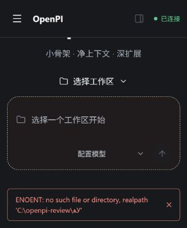

# Windows workspace picker: Unicode stdout boundary

- Status: validated at the subprocess encoding boundary and in real Windows Web interaction under CP936, with manual native-dialog selection.
- Created: 2026-10-08. Last verified: 2026-10-09.
- Source boundary: baseline `3cb2ecfe1bfbb98252651885311d309f83749428` and implementation head `50107076f4f241d136c6aaa6b458c90d5d815932`; subsequent evidence additions are documentation only.
- Related Issue and implementation PR: [#712](https://github.com/openpi-dev/openpi/issues/712), [PR #713](https://github.com/openpi-dev/openpi/pull/713).
- Superseding relationship: none; this is a scoped bug investigation, not a new project constraint.

## Verified facts

The Windows folder picker runs in `powershell.exe`. Its selected path crosses a stdout pipe before the Web host validates it with `realpath`. With CP936 output, `学校` produces bytes `d1 a7 d0 a3`; decoding those bytes as UTF-8 produces `ѧУ`. An existing directory can therefore become a different, nonexistent path before workspace validation.

The regression test runs real Windows PowerShell with initial CP936 output and substitutes only the COM folder dialog. It uses the production chooser script and actual temporary directories. Chinese names, spaces, and emoji fail without the script's UTF-8 output setting and pass with it. Assertions cover exact UTF-8 bytes, decoded path equality, successful `realpath`, and empty output on cancellation.

The reporter separately confirmed that adding a Chinese-named workspace works after restarting the patched Web host. No private workspace paths, credentials, or Session data are needed to reproduce the encoding mismatch.

## Fix and validation

Set `[Console]::OutputEncoding` to UTF-8 without a BOM inside the picker subprocess and explicitly request UTF-8 decoding in Node. The existing picker, abort signal, and cancellation handling remain in place.

- `bun run check`: passed.
- Targeted Windows picker regression: 5 reported tests passed, including its parent test.
- `bun run test`: its parallel Node group reported 2,188 passed, 5 failed, and 14 skipped; the aggregate command stopped at those failures.
- Separate remaining groups: `node scripts/run-tests.mjs node-serial` reported 99 passed and 4 skipped; `bun run test:ui` passed all 1,158 tests across 82 files.

The same five parallel-group failures occurred before the fix on this Windows host at `26da591`: one in `git-review`, three in `transcript-search`, and one in `turn-changes`. Four report symlink `EPERM`; the remaining test expects a `changed-session` reason after symlink substitution. This is a comparison with the earlier local checkout, not a clean upstream baseline or a passing full suite.

## Real Windows Web verification: 2026-10-09

Both runs used the same Windows machine, browser, and existing temporary directory, `C:\openpi-review\学校`. The reporter selected it through the real Web workspace-selection entry and Windows Shell folder dialog. The dialog was operated manually because the computer-control tool did not expose that PowerShell-owned window. The page screenshots below are direct, unedited browser captures; they contain no access token or private workspace data.

| Environment | Both runs |
| --- | --- |
| OS | Windows 11 Pro, version `10.0.26200`, build `26200` |
| Windows PowerShell | `5.1.26100.9444` (`powershell.exe`) |
| Node | `v24.12.0` |
| Console condition | CP936, explicitly selected in each launcher's own console with `chcp.com 936` and matching console output encoding |
| Child-process encoding probe | PowerShell output code page `936`, input code page `936`, default ANSI encoding `936` |
| Checkout / unique OpenPI source | `E:\OpenPi`, loaded as a local source package |
| Isolation | Fresh `PI_CODING_AGENT_DIR` per run; `PI_OFFLINE=1`, `PI_SKIP_VERSION_CHECK=1`; no model or credentials configured |
| Web launch | `node E:\OpenPi\bin\openpi.js web --no-workspace --port 50878 --no-open` |

Before each launch, `git rev-parse HEAD` and `pi list` were recorded. In each isolated environment, `pi list` showed only `User packages: E:/OpenPi -> E:\OpenPi`. Both checkouts had clean tracked files at capture time. The baseline host was stopped before switching source, the production UI was rebuilt at each revision with `bun run build:web`, and a new host was started and the browser reloaded. No chooser stub, path injection, or source instrumentation was used in these runs. CP936 was deliberately held constant for reproducibility; the machine's system locale was not changed.

| Run | Exact loaded revision | Observed result |
| --- | --- | --- |
| Before | `3cb2ecfe1bfbb98252651885311d309f83749428` | `ENOENT: no such file or directory, realpath 'C:\openpi-review\ѧУ'`; workspace was not added |
| After | `50107076f4f241d136c6aaa6b458c90d5d815932` | `学校` was added, appeared in the workspace list, and could be selected in the workspace menu; the header's accessibility projection retained `C:\openpi-review\学校`, and the task composer accepted the unsent draft `工作区测试（未发送）` |

Before, captured from the baseline Web page:

After, captured after selecting the added workspace from the menu and entering a draft without sending it:

[Additional screenshot: the workspace appears in the sidebar](assets/windows-workspace-picker-2026-10-09/after-workspace-list.jpg).

The implementation head's [upstream CI run](https://github.com/openpi-dev/openpi/actions/runs/37772950126) completed all 19 reported checks successfully, including Windows jobs. This is separate from the earlier local Windows suite failures above. The screenshots verify workspace import and selection; no model turn was sent.

The documentation follow-up also ran `bun run check` successfully and repeated `bun run test` on 2026-10-09. Its parallel Node group reported 2,186 passed, 7 failed, and 14 skipped out of 2,207 tests; the picker regression passed. The earlier five Windows failures recurred, plus two Antigravity fixture failures (OAuth callback HTTP `502` instead of `400`, and stalled-body request count `0` instead of `2`). Their causes were not established or attributed to this fix. The aggregate command exited before serial Node/UI stages, so their earlier results above were not revalidated in this repeat. The follow-up changes only documentation and screenshots, with runtime/test blobs unchanged from the reviewed implementation head.

## CI follow-up at documentation head `209ca8a`: 2026-10-09

[CI run 37877649030](https://github.com/openpi-dev/openpi/actions/runs/37877649030) passed every Runtime Node, Windows, and UI job. [Web E2E shard 1/2](https://github.com/openpi-dev/openpi/actions/runs/37877649030/job/113650094264) reported 51 passed and one failed: `tests/web/message-rerun.e2e.ts:209` timed out waiting for the regeneration acknowledgement. The Web E2E and Node 26 summary checks failed because that shard failed; the actual Node 26 runtime job passed.

The retained CI screenshot and trace show a successful fork receipt for the correct child, followed by the notice "无法确认分叉结果。请先刷新并检查会话列表，再决定是否重试。" No regeneration prompt was sent. Both confirmation snapshots immediately after the fork returned the same correct, controlled child. The trace does not record the internal snapshot generation or prove its exact scheduling.

Source comparison against baseline `3cb2ecfe1bfbb98252651885311d309f83749428` confirms that the Web UI, this E2E test, and CI configuration are unchanged at `209ca8a1880bbd0ccd462450d940d8efdda4df36`. The store blob is `a6d745cdaae2989cce7ff63344d26338ec43d484` and the E2E blob is `7f08508c264d8dbf3189686582cb04b92f897a4c` at both revisions. This Ubuntu mock-message test does not invoke the Windows chooser branch modified by this PR.

Further local investigation used the unchanged implementation at `209ca8a`. The existing mock E2E passed five consecutive runs; another 20 repeats reported 17 passed and three failed. Those failures occurred earlier, while confirming the edited-message child, with the same uncertainty notice and no prompt request; they did not reach the fixture's intended prompt rejection. These observations are not a measured CI failure rate.

A controlled probe through the real `createWebStore`, `regenerateMessage`, and `refreshSnapshot` actions isolated a same-child refresh race. Across five paired trials, confirmation alone accepted and sent one prompt; a competing refresh that confirmed the identical child made the original confirmation return false, display uncertainty, and send zero prompts. This establishes an existing runtime defect and supports the explanation of the captured CI symptom; it does not claim to instrument the historical CI execution.

The independent defect is tracked in [Issue #717](https://github.com/openpi-dev/openpi/issues/717), with a separate proposed repair and deterministic regressions in [PR #718](https://github.com/openpi-dev/openpi/pull/718). Neither that repair nor any change to the rerun E2E is included in this Windows encoding PR. The follow-up here preserves the CI diagnosis while keeping the original scope. A fresh CI run may pass or encounter the existing race again; a passing retry would not repair it. Raw local traces and probe output remain outside Git.

For this documentation-only CI refresh, `bun run check` passed. `bun run test` reported 2,188 passed, 5 failed, and 14 skipped in its 2,207-test parallel Node group, with the same five previously listed Windows test failures; the picker regression passed. The aggregate command stopped there, so serial Node and UI stages were not revalidated in this refresh. Runtime and test sources remain unchanged from `5010707`.

## Boundaries

The automated fixture checks the real PowerShell stdout boundary and stubs the native dialog; it does not automate the full browser/dialog interaction. The added Web screenshots cover real native-dialog selection with human input under the controlled CP936 condition. Two earlier attempts exceeded the Web request's 15-second deadline; their timeout captures are excluded from the published evidence. Other Windows code pages were not individually exercised. macOS and Linux chooser branches, persisted configuration, and Pi provider/model behavior are outside this change.
